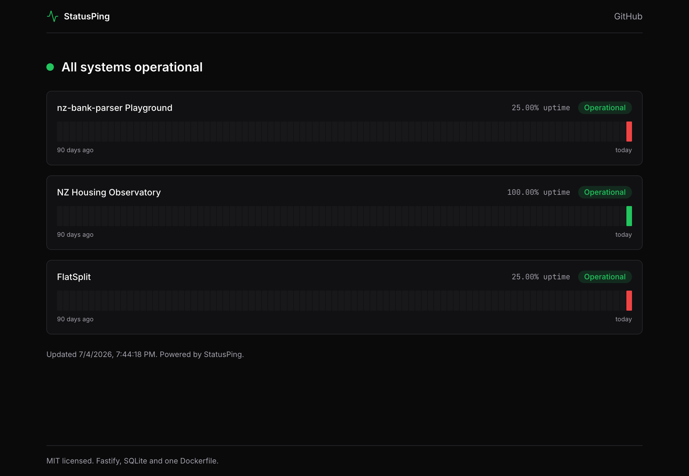
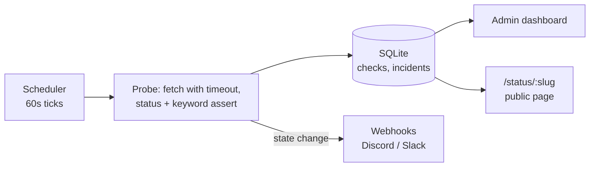

[](https://github.com/R1chi33333/statusping/actions/workflows/ci.yml)
[](https://codecov.io/gh/R1chi33333/statusping)
[](./LICENSE)

# StatusPing — self-hosted uptime monitoring in one container

[Live Status Page](https://statusping-production.up.railway.app/status/portfolio) · [Documentation](#self-hosting) · [Report Bug](https://github.com/R1chi33333/statusping/issues/new?template=bug_report.md)

[](https://railway.com/new/template?template=https%3A%2F%2Fgithub.com%2FR1chi33333%2Fstatusping)



The status page above is this repository's own instance, watching the other three projects in this portfolio: [nz-bank-parser](https://github.com/R1chi33333/nz-bank-parser), [FlatSplit](https://github.com/R1chi33333/flatsplit) and [NZ Housing Observatory](https://github.com/R1chi33333/nz-housing-observatory). The red cells are real: two keyword assertions were misconfigured on day one (keyword checks read the raw HTML, not the rendered page) and the incidents stayed on the record.

## Why this exists

Uptime monitoring services meter you by monitor count, and their free tiers watch your sites less often than your users do. StatusPing is the whole thing in one container you own: probe any URL every minute, keep latency history in SQLite, get a webhook when something goes down, and share a public status page. No accounts, no metering, one Dockerfile.

## Features

- HTTP probes every 60 seconds: status code, response time, optional keyword assertion
- Incident tracking with webhook alerts (Discord and Slack) for down and recovery
- Latency charts over 24 hours, 7 days and 30 days
- Public status page with 90-day availability bars, no login required
- Single container: Fastify plus SQLite, no external services
- Bearer-token admin, environment-variable configuration

## Architecture



## Tech Stack

TypeScript (strict), Fastify, better-sqlite3, React, Recharts, Tailwind CSS, Vitest, Playwright. Ships as a single Docker image.

## Self-hosting

```bash
git clone https://github.com/R1chi33333/statusping.git
cd statusping
ADMIN_TOKEN=$(openssl rand -hex 16) docker compose up --build
```

Open http://localhost:3000, sign in with the token, add your first monitor. The SQLite file lives in a named volume; back it up and you have backed up everything.

For development without Docker:

```bash
npm ci
cp .env.example .env   # set ADMIN_TOKEN
npm run dev            # API on :3000
npm run dev:web        # UI on :5173, proxying /api
```

## Testing

```bash
npm test               # probe, scheduler and notification unit tests
npm run test:coverage  # with coverage report
npm run e2e            # Playwright: admin flow and public status page
```

## Roadmap

See [ROADMAP.md](./ROADMAP.md).

## License

[MIT](./LICENSE)
